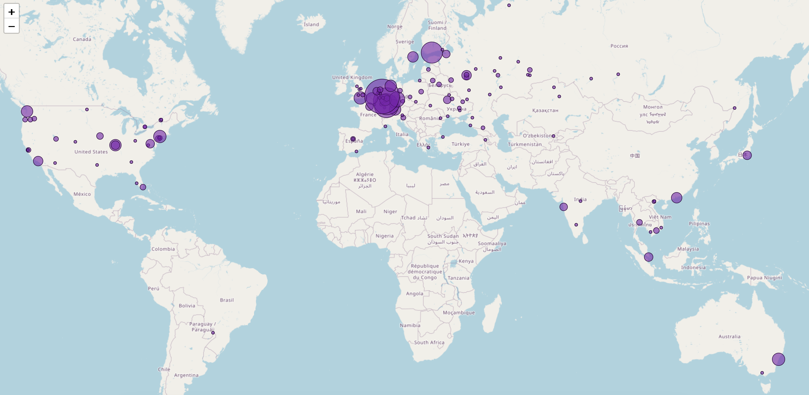

# fc-nmap

**THis software is still in alpha and under heavy development.** Things will change and break.

[](https://pypi.org/project/fc-nmap)
[](https://pypi.org/project/fc-nmap)

-----



## Quickstart

```console
pip install fc-nmap

fc-nmap --help

Usage: fc-nmap [OPTIONS] COMMAND [ARGS]...

  Farcaster Network Mapper

Options:
  --version   Show the version and exit.
  -h, --help  Show this message and exit.

Commands:
  exportdb  Create a tab separated dump of the database
  initdb    Initialize the database
  scan      Scan will scan the network
  updatedb  Collect addtional information about each hub
  map       Create a mpa of the hubs in db
```

## Behind the scenes

`fc-nmap initdb` creates a local sqlite database where data is stored.

`fc-nmap scan` will start by asking a hub to provide its contact list (gRPC call `GetCurrentPeers`). Using this list, it will pick `--hops`
hubs at random, and request their contact list too. The lists are combined and stored in the database.

`fc-nmap updatedb --hub-info` looks into the database and picks hubs that were recently active.
(Recency is defined by comparing `ContactInfoContentBody.timestamp` collected when requesting the contacts lists and the current timestamp.)
The command will try to connect to each one of the hubs, and collect additional info using `GetInfo`, and store the results in the local
database.

`fc-nmap updatedb --hub-location` works similar to `--hub-info`, but uses ip2location.io to get location information about each hub IP.
Again, information collected is stored in the local database. The script will not query ip2location for IPs that were looked up in the last
100 days. This helps staying within ip2location free plan limits.

`fc-nmap export --report=all` will export all "active" hubs. Use fc-nmap export --help` to get all the available exports/reports.
Or connect directly to the local database (currently named hubs.db and stored in the directory where you called the previous commands)
and run your own queries.

## License

`fc-nmap` is distributed under the terms of the [MIT](https://spdx.org/licenses/MIT.html) license.
